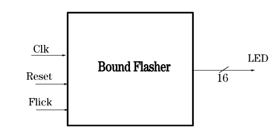
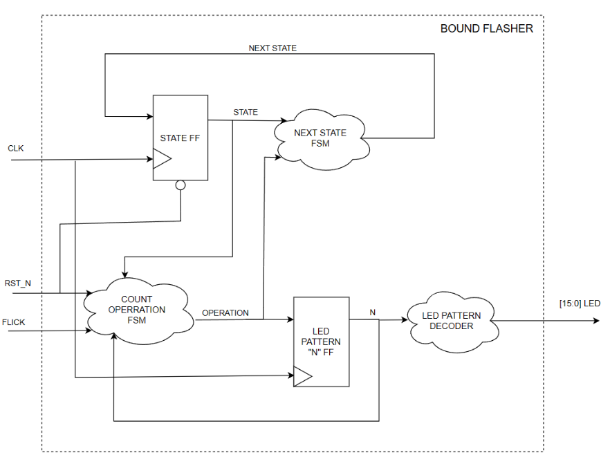
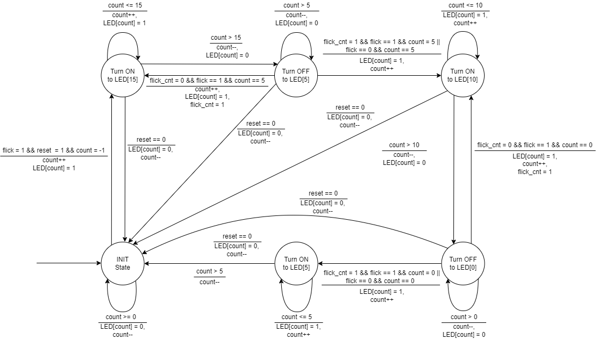

# Bound_Flasher

### List of members implementing the project (Danh sách thành viên):
|STT|MSSV|Họ và tên|
|:---:|----|:---------|
|1|2112173|Phạm Hồng My Sa|
|2|2110564|Nguyễn Trường Thịnh|
|3|2013053|Nguyễn Tấn Hào|
|4|2013037|Danh Sơn Hà|

## Design Specification
### 1. Interface

Description of signals in Bound Flasher:

|Signal|Width|In/Out|Description|
|:----:|:-----:|:----:|:---------:|
|Clk|1|In|Flick Signal|
|Reset|1|In|Reset Signal|
|Flick|1|In|Clock Signal|
|LED|16|Out|16 LEDS|

### 2. Functional implementation
- Implement a 16-bits LEDs system
- System’s Operation base on three input signal: Reset, Clock and Flick
- System specification:
    - Clock signal is provided for system inspire of function status. The function operate state’s transition at positive edge of the clock signal.
    - Reset signal:
        - LOW-ACTIVE Reset = 0: System is restarted to Initial State.
        - HIGH-ACTIVE Reset = 1: System is started with initial state.
- Flick signal: special input for controlling state transfer.
- At the initial state, all lamps are OFF. If flick signal is ACTIVE, the flasher start operating:
  - The lamps are turned ON gradually from LEDs [0] to LEDs [15].
  - The LEDSs are turned OFF gradually from LEDs [15] to LEDs [5].
  - The LEDSs are turned ON gradually from LEDs [5] to LEDs [10].
  - The LEDSs are turned OFF gradually from LEDs [10] to LEDs [0].
  - The LEDSs are turned ON gradually from LEDs [0] to LEDs [5].
  - Finally, the LEDs are turned OFF gradually from LEDSs [5] to LEDSs [0], return to initial state.
- Additional condition: At each kickback point (LEDs [5] and LEDs [0]), if flick signal is ACTIVE, the LEDs will go back and repeat that STATE. For simple, kickback point is considered only when the LEDs are turned OFF gradually, except final state.

### 3. Internal implementation
#### 3.1 Overall
Block diagram of system:

|Components|Description|
|:----:|:-----:|
|FSM|Khối này quyết định trạng thái tiếp theo của hệ thống|
|Counter|Bộ đếm số đếm trạng thái của đèn LED|
|LED pattern decoder|Bộ dịch số đếm thành trạng thái đèn LED|
|D-FF Current State|D-Flip Flop lưu trạng thái hiện tại của FSM|

#### 3.2 State machine
State machine of system:

Variable name of State machine:
|Variable Name|Description|
|:----:|:-----|
|count|Lưu giá trị đèn LED đang mở (ON) (count = 1: ON, count = 0: OFF); giúp xác định state tiếp theo|
|flick|Tín hiệu input quyết định state tiếp theo nếu state hiện tại là “Turn OFF to LED[5]” hoặc “Turn OFF to LED[0]” và đang ở kickback point|
|reset|Tín hiệu input để quyết định đưa state hiện tại về trạng thái “INIT State”|
|LED[i]|Tín hiệu output xác định LED hiển thị|

State name of State machine
|State|Description|
|:----:|:-----|
|INIT|Trạng thái khởi tạo|
|Turn ON to LED[15]|Trạng thái 1 của hệ thống: “The LEDs are turned ON gradually from LEDs [0] to LEDs [15]”|
|Turn OFF to LED[5]|Trạng thái 2 của hệ thống: “The LEDs are turned OFF gradually from LEDs [15] to LEDs [5]” và trạng thái khi ở tại kickback point LED[5]|
|Turn ON to LED[10]|Trạng thái 3 của hệ thống: “The LEDs are turned ON gradually from LEDs [5] to LEDs [10]” |
|Turn OFF to LED[0]|Trạng thái 4 của hệ thống: “The LEDs are turned OFF gradually from LEDs [10] to LEDs [0]” và trạng thái khi ở tại kickback point LED[0]|
|Turn ON to LED[5]|Trạng thái 5 của hệ thống: “The LEDs are turned ON gradually from LEDs [0] to LEDs [5]”|

